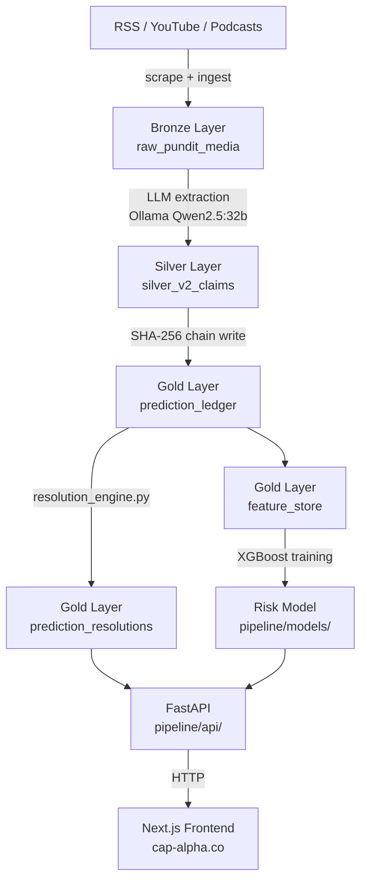

# Cap Alpha — Pundit Prediction Ledger

A tamper-evident ledger that tracks what NFL analysts actually predicted, scores them on outcome accuracy, and publishes the results.

Live at **[cap-alpha.co](https://cap-alpha.co)**

---

## What this is (and is not)

The sports media industry has no accountability layer. Analysts make confident predictions on draft picks, trades, and player performance; the predictions vanish; the analysts repeat the cycle. This project changes that by extracting predictions from RSS feeds, YouTube transcripts, and podcasts at ingest time, storing each claim in a SHA-256 chained ledger, resolving claims against ground-truth outcomes, and computing per-pundit accuracy scores using Brier scoring weighted by timeliness.

**This is not a sports-betting tool.** It is a pundit accountability ledger.

The editorial model uses three layers of evidence: what the analyst **said**, what they likely **meant** (intent, framing, hedging), and what actually **happened**. Scoring axes go beyond binary correct/incorrect — they include lead time, claim specificity, and category (draft picks, contracts, player performance).

---

## Architecture



All layers live in BigQuery (`nfl_dead_money` dataset). Bronze is raw scraped content. Silver holds cleaned, typed claims. Gold holds the ledger, resolutions, and ML features. All BigQuery access is funnelled through `pipeline/src/db_manager.py`.

### Key components

| Component | Path | Does |
|---|---|---|
| Media ingestor | `pipeline/src/media_ingestor.py` | Pulls RSS, YouTube, podcast feeds |
| LLM extractor | `pipeline/src/assertion_extractor.py` | Extracts structured predictions via Ollama |
| Cryptographic ledger | `pipeline/src/cryptographic_ledger.py` | SHA-256 chained append-only writes |
| Resolution engine | `pipeline/src/resolution_engine.py` | Matches predictions to outcomes, computes Brier score |
| Feature factory | `pipeline/src/feature_factory.py` | Builds ML feature vectors |
| Risk model | `pipeline/src/train_model.py` | XGBoost, walk-forward validation |
| REST API | `pipeline/api/pundit_router.py` | `/v1/pundits/`, `/v1/leaderboard`, `/v1/predictions/` |
| Frontend | `web/app/` | Next.js 14 with Clerk auth, pundit detail pages, leaderboard |

---

## Local setup

Requires Python 3.13+ and Node 20+. Tests and linting run without Docker.

```bash
# 1. Bootstrap venv + git hooks
make setup

# 2. Run unit tests
make test

# 3. Lint
make lint

# 4. Start the API (from pipeline/)
cd pipeline && uvicorn api.main:app --reload

# 5. Start the frontend
cd web && npm run dev
```

Docker is only needed for browser-based scraping (`make pipeline-scrape`) and Playwright E2E tests (`make test-e2e`).

Set `GCP_PROJECT_ID`, `GOOGLE_APPLICATION_CREDENTIALS`, and `OLLAMA_BASE_URL` as environment variables before running the pipeline. Settings live in `pipeline/config/settings.yaml`. For local testing without BigQuery, set `USE_LOCAL_DB=1` to use a DuckDB fallback.

---

## Tech stack

- **Data warehouse**: BigQuery (medallion architecture: bronze / silver / gold)
- **LLM extraction**: Ollama — Qwen2.5:32b running locally (zero cloud inference cost)
- **ML**: XGBoost, scikit-learn, SHAP; walk-forward backtest
- **Ledger integrity**: SHA-256 hash chain, verified at `/v1/integrity/verify`
- **Pipeline orchestration**: Python + Airflow DAG (`pipeline/dags/`)
- **API**: FastAPI + Cloud Run
- **Frontend**: Next.js 14, TypeScript, Tailwind, Clerk auth, Stripe billing
- **CI**: GitHub Actions with required preflight gate and merge queue

---

## API

The REST API is public and key-gated. Interactive schema at [cap-alpha.co/docs](https://cap-alpha.co/docs).

```
GET /v1/leaderboard              — ranked pundits by weighted accuracy score
GET /v1/pundits/{id}             — pundit detail with accuracy by category
GET /v1/pundits/{id}/predictions — paginated prediction history
GET /v1/integrity/verify         — SHA-256 chain integrity check
```

---

## Repository layout

```
pipeline/        Python ETL, LLM extraction, resolution engine, FastAPI
  src/           Core pipeline modules
  api/           FastAPI app and routers
  tests/         pytest unit tests (make test)
  config/        YAML configs: LLM provider, media sources, ML hyperparams
  models/        Trained XGBoost artifacts (gitignored)
web/             Next.js frontend
  app/           App Router pages: ledger, dashboard, draft, docs
  lib/           Shared utilities, API key tier definitions
dbt/             dbt models for dim/fct marts on top of gold layer
docs/            API reference, scoring methodology
```
