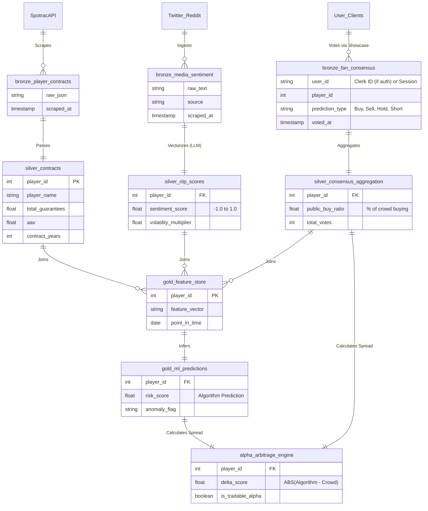

# NFL Dead Money: MotherDuck Data Lake Architecture

This Entity Relationship Diagram (ERD) maps the flow of data from raw external sources (Spotrac, Rumor Mill) into the strict Medallion Architecture (Bronze -> Silver -> Gold). 

The addition of the **Fan Consensus Engine** introduces a new high-value raw feed.

### Table Definitions

**1. The `bronze` Schema:**
Stores immutable, append-only raw data. If our parsing logic breaks, we can always replay from Bronze. The new `bronze_fan_consensus` will record every individual click from the Fan Dashboard.

**2. The `silver` Schema:**
Where the magic happens. Types are enforced. Missing data is imputed. NLP text is crushed into floating-point vectors (`silver_nlp_scores`). Fan votes are aggregated into ratios (`silver_consensus_aggregation`).

**3. The `gold` Schema:**
The final product. This is practically a denormalized Feature Store. The `alpha_arbitrage_engine` is the mathematical difference between what the *System* predicts (`risk_score`) and what the *Crowd* believes (`public_buy_ratio`). Executives pay for access to high-delta assets.
